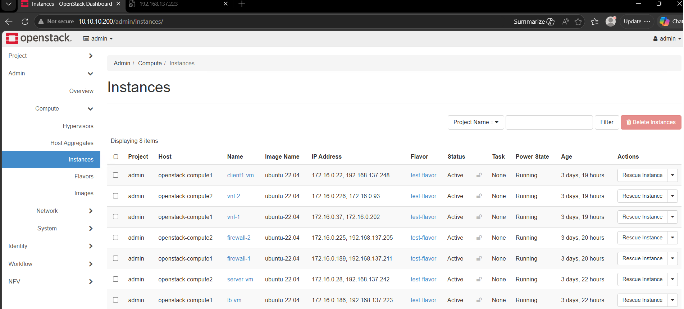
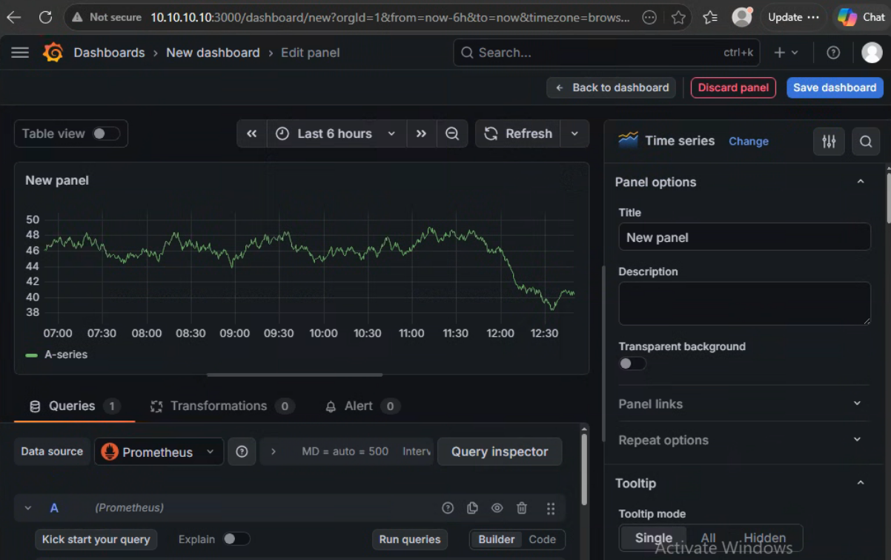

# OpenStack 2024.2 Kolla-Ansible Multinode Deployment

This repository documents a real, verified multinode OpenStack deployment using Kolla-Ansible on Ubuntu 24.04.4 LTS. It serves as a practical, production-style reference for infrastructure engineers looking to deploy and manage OpenStack services via containers.

> **📖 Full Step-by-Step Guide:** For the complete walkthrough, commands, and comprehensive screenshots, see the [Kolla Deployment Guide](KOLLA_DEPLOYMENT_GUIDE.md).

---

## 🏛️ Architecture Summary

The environment is built on a highly available, three-node architecture using Open vSwitch (OVS) for networking and containerized services for the control plane.

### Node Layout

| Node | Management IP (`ens34`) | Role | Deployed Services |
|------|-------------------------|------|-------------------|
| **openstack-controller** | `10.10.10.10` | Control, Network, Storage, Monitoring | APIs, DB, RabbitMQ, Horizon, Prometheus |
| **openstack-compute1** | `10.10.10.11` | Compute | Nova-Compute, Neutron-OVS, Placement |
| **openstack-compute2** | `10.10.10.12` | Compute | Nova-Compute, Neutron-OVS, Placement |

**HAProxy / Keepalived VIP:** `10.10.10.200`

### Key Deployed Services

- **Core:** Keystone, Nova, Neutron, Glance, Placement
- **Orchestration & NFV:** Heat, Tacker, Mistral
- **Security:** Barbican
- **Monitoring:** Prometheus, Grafana
- **Dashboard:** Horizon

---

## 📸 Deployment Previews

 

**Horizon Dashboard — Instance Overview**

  

**Grafana — Infrastructure Monitoring**

  

---

## ✅ Verification Highlights

The deployment was fully validated with the following successful outcomes:
- **Compute:** 2 active hypervisors registered (`openstack-compute1`, `openstack-compute2`).
- **Containers:** All Docker containers reported as `Up (healthy)`.
- **Networking:** Active Neutron OVS, L3, and DHCP agents with fully functional floating IP assignments via `br-ex`.
- **Workloads:** Successfully launched Ubuntu 22.04 instances (`client1-vm`, `lb-vm`).
- **NFV:** Tacker successfully orchestrated and managed multiple Virtual Network Functions (`vnf-1`, `vnf-2`, `firewall-1`, `firewall-2`).
- **Monitoring:** Grafana dashboards actively scraping metrics from Prometheus node and container exporters.

